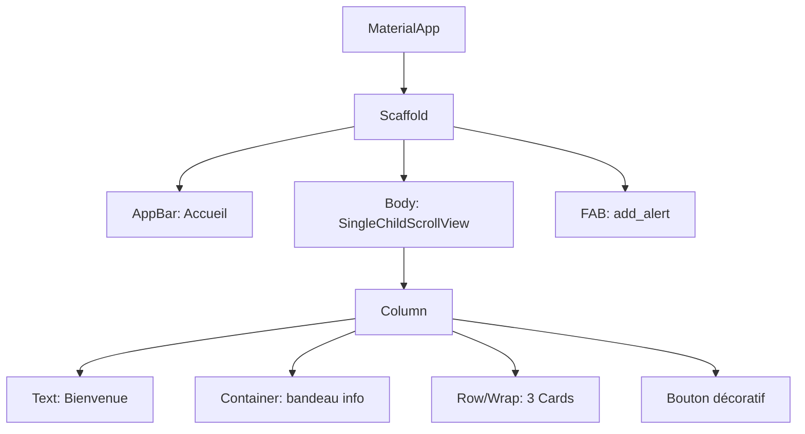
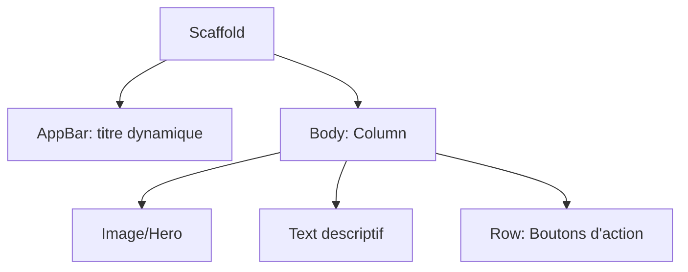
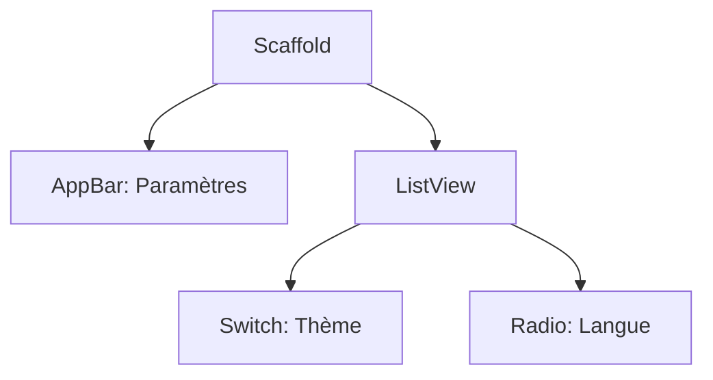
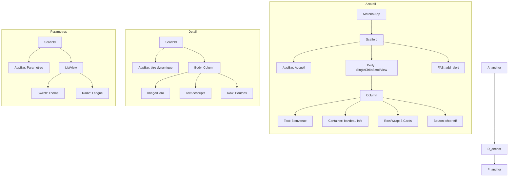
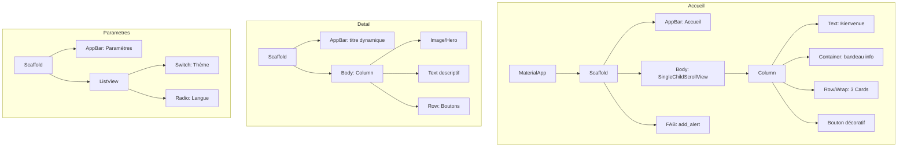
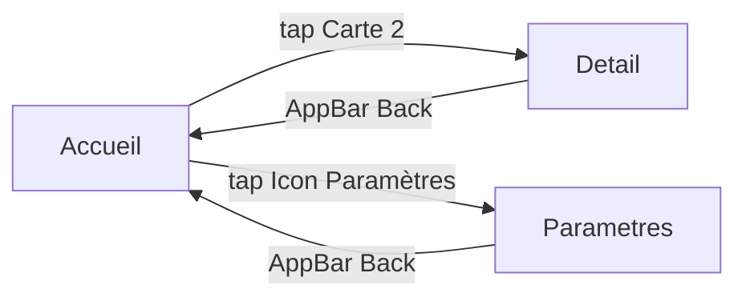
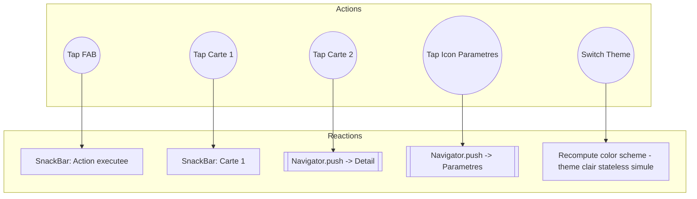
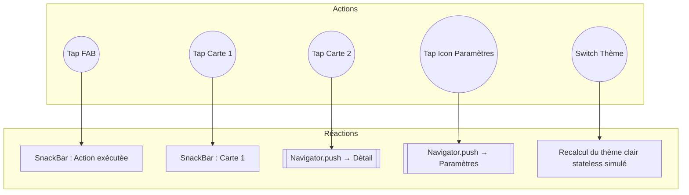
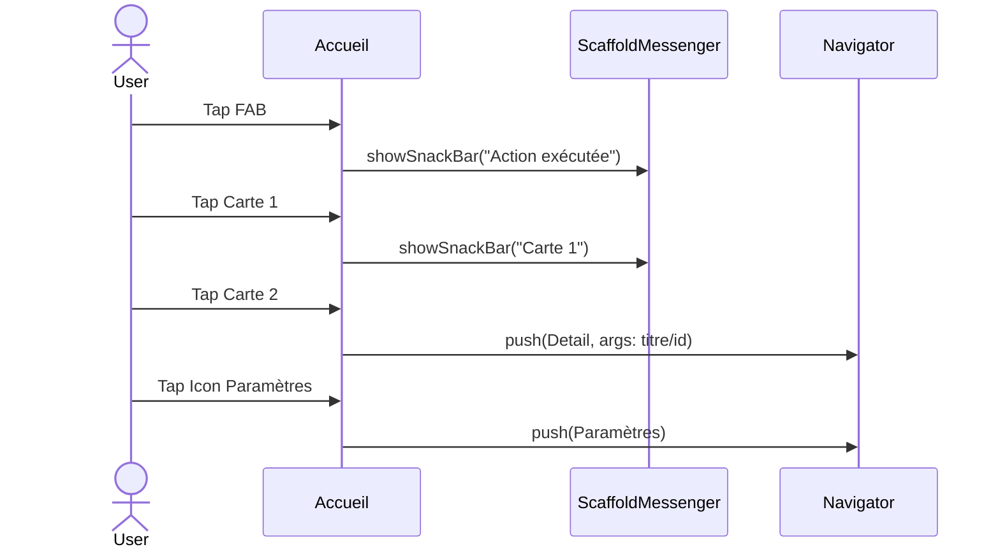

# Exercice 3 — Création d’une nouvelle application Flutter avec **widgets stateless**-Actions → Réactions

> **But** : Concevoir une petite app *sans état interne* (stateless uniquement) avec **trois écrans** (Accueil, Détail, Paramètres), en décrivant clairement :
>
> 1. **L’arborescence des widgets** (Widget Tree)
> 2. **La navigation entre écrans** (flux “tap” → écran)
> 3. **Les interactions utilisateur** → **réactions UI** (SnackBar, Navigation)

---

## Instructions générales

1. Produire **l’arborescence des widgets** pour les trois écrans (Accueil, Détail, Paramètres).
2. Décrire **les flux de navigation** (qui tape quoi, vers quel écran).
3. Lier **chaque interaction** (tap) à une **réaction UI** (SnackBar, push navigation).

**Contraintes :**

* Utilisez des **noms de widgets Flutter réels** : `MaterialApp`, `Scaffold`, `AppBar`, `SingleChildScrollView`, `Column`, `Row`, `Card`, `Icon`, `FloatingActionButton`, `ListView`, etc.
* **Aucun état interne** (pas de `StatefulWidget`, pas de “Idle/Loading”).
* Navigation : `Navigator.push`/`pop` depuis des **Stateless** (l’événement de tap déclenche la navigation).

---

## Partie 1 — Arborescence des Widgets (ASCII)

> **À faire :** représenter la **structure hiérarchique** de vos trois écrans. Complétez / adaptez les modèles ci-dessous.

```
Écran Accueil
└─ MaterialApp
   └─ Scaffold
      ├─ AppBar (titre: Accueil)
      ├─ Body (SingleChildScrollView)
      │  ├─ Column
      │  │  ├─ Text("Bienvenue")
      │  │  ├─ Container (bandeau info)
      │  │  ├─ Row (3 Cartes)
      │  │  └─ Bouton décoratif
      └─ FloatingActionButton (Icon: add_alert)

Écran Détail
└─ Scaffold
   ├─ AppBar (titre dynamique)
   ├─ Body (Column)
   │  ├─ Image/Hero
   │  ├─ Text descriptif
   │  └─ Row (Boutons d’action)

Écran Paramètres
└─ Scaffold
   ├─ AppBar ("Paramètres")
   └─ Body (ListView)
      ├─ ListTile (Switch Thème)
      └─ ListTile (Radio Langue)
```

---

## Partie 2 — Navigation entre écrans (flux “tap” → écran)

> **À faire :** lister les **transitions** déclenchées par l’utilisateur.

```
Accueil --(tap Carte 2)--> Détail
Accueil --(tap Icon Paramètres)--> Paramètres
Détail --(AppBar Back)--> Accueil
Paramètres --(AppBar Back)--> Accueil
```

---

## Annexes — Interactions utilisateur → Réactions UI (Mermaid)

### Accueil



### Détail



### Paramètres



---

## Vision “1 seul bloc en pile” (3 sous-graphes)



---

## Arborescence des Widgets (3 sous-graphes)



---

## Navigation entre écrans (Mermaid)



---

## Interactions UI — Flowchart (Actions → Réactions)


Tu as un bug Mermaid à cause de caractères spéciaux/parenthèses dans le label du nœud `Recompute`. Voici une version **ASCII-safe** (sans accents ni flèches “→”, sans parenthèses dans les labels) qui se rend bien sur GitHub :



Si tu veux garder les accents et la flèche “→”, évite les parenthèses dans les labels, par exemple :




## Diagramme de séquence (Mermaid)



---

## Livrables

* **PDF (2–3 pages)** :

  * Les **trois arborescences** (ASCII ou images)
  * Le **schéma de navigation** (texte ou Mermaid)
  * Le **mapping interactions → réactions** (Mermaid recommandé)
* **Captures** :

  * Accueil
  * Détail
  * Paramètres
* **Mini-rapport (5–8 lignes)** : widget principaux, logique de navigation, choix UI.

## Barème (40 pts)

* Arborescences précises et complètes (3 écrans) — **14 pts**
* Navigation (flux clairs, aller/retour) — **10 pts**
* Interactions → Réactions (SnackBar/Navigation) — **10 pts**
* Qualité de présentation (lisibilité, cohérence, respect des contraintes) — **6 pts**

---

## Rappels commandes

```bash
flutter create pratique2_stateless
cd pratique2_stateless
flutter pub get
flutter run
flutter doctor -v
```

> Astuce : Même **sans Stateful**, vous pouvez **déclencher** SnackBar et Navigation depuis des *handlers* (onTap/onPressed) dans des **Stateless** en utilisant `ScaffoldMessenger.of(context)` et `Navigator.of(context)`.
